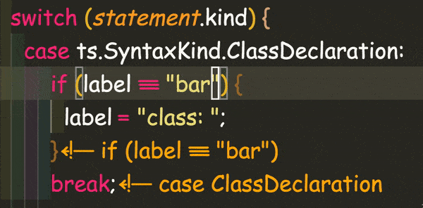

# js-ts--biscuits README

Use js-ts-biscuits to make code soup and callback spaghetti more digestible. Annotate ALL the end brackets/parentheses/etc. (that have relevant metadata)!!!

## Warning! JSON, JSX/TSX, Vue, and Svelte currently unsupported

This extension has issues with those formats. We are currently planning specific plugins for those use cases.

## Warning! Potential Plugin Conflict

In the current implementation, code-biscuits prevent seeing GitLens annotations. Issue can be tracked here:
[https://github.com/code-biscuits/html-biscuits/issues/2](https://github.com/code-biscuits/html-biscuits/issues/2)

The HTML extension getting fixed will be the blueprint for fixing other extensions in the same way.

## Configuration

- `js-ts-biscuits.annotationColor` _string_ : Determines the color of annotation. Accepts any valid CSS color string.

  - default: vscode.ThemeColor("editorLineNumber.foreground"),

- `js-ts-biscuits.annotationPrefix` _string_ : Determines beginning of the annotation text. Empty string is acceptable.

  - default: `"// "`,

- `js-ts-biscuits.annotationMinDistance` _number_ : Determines the minimum amount of lines between start and end tag used to decide to show the annotations.

  - default: `0`,

- `js-ts-biscuits.annotationMaxLength` _number_ : What is the longest annotation you should see before we cut it off ewith a `...`? A 0 value shows the full string.
  - default: `80`,

## Release Notes

### 0.0.14

Removed JSON support in favor of a JSON specific extension later

### 0.0.13

Add configuration for maximum annotation length and update defaults

### 0.0.12

Handle Function Expressions and Arrow Functions better

### 0.0.11

Add extra handler to bail out of Vue and Svelte files (anything with a `<script>`) until we can handle those cases better

### 0.0.9

Change activation events to only target js, ts, and json files for now

### 0.0.8

Show more nested nodes and update operator map to support more symbols and operators

### 0.0.7

Only wrap string literal values in quotes

### 0.0.6

Get switch case clauses and blocks working

### 0.0.4

Recursively annotate if, switch, for, and while statements

### 0.0.3

First tested public launch

## Attributions

- Logo: biscuit by Bartama Graphic from the Noun Project

## License

Copyright 2020 code-biscuits

Permission is hereby granted, free of charge, to any person obtaining a copy of this software and associated documentation files (the "Software"), to deal in the Software without restriction, including without limitation the rights to use, copy, modify, merge, publish, distribute, sublicense, and/or sell copies of the Software, and to permit persons to whom the Software is furnished to do so, subject to the following conditions:

The above copyright notice and this permission notice shall be included in all copies or substantial portions of the Software.

THE SOFTWARE IS PROVIDED "AS IS", WITHOUT WARRANTY OF ANY KIND, EXPRESS OR IMPLIED, INCLUDING BUT NOT LIMITED TO THE WARRANTIES OF MERCHANTABILITY, FITNESS FOR A PARTICULAR PURPOSE AND NONINFRINGEMENT. IN NO EVENT SHALL THE AUTHORS OR COPYRIGHT HOLDERS BE LIABLE FOR ANY CLAIM, DAMAGES OR OTHER LIABILITY, WHETHER IN AN ACTION OF CONTRACT, TORT OR OTHERWISE, ARISING FROM, OUT OF OR IN CONNECTION WITH THE SOFTWARE OR THE USE OR OTHER DEALINGS IN THE SOFTWARE.
